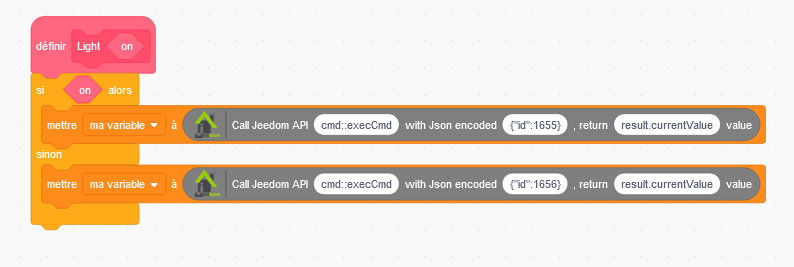
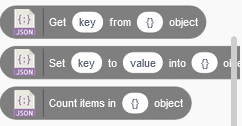

# Jeedom extension for Scratch

## What is Scratch ?

Scratch is the world's largest coding community for children and a coding language
 with a simple visual interface that allows young people to create digital stories,
  games, and animations. Scratch is designed, developed, and moderated by the
   Scratch Foundation, a nonprofit organization.

https://scratch.mit.edu/about

It is just a simple Javascript app you can run directly in your usual browser, nothing to install !

## What is this extension used for ?

This extension add some new blocks to the Scratch program, to act with your lovely Jeedom box !
 Using the Jeedom API, you can build some simple Scratch scenario that will light your home or
 check your bedroom temp...

 ## Starting instructions

 Try it here : https://pifou25.github.io/scratch/scratch/

Click on the bottom left icon to open the list of available extensions : Then, select the Jeedom extension

 

You can now see some new blocks added at the bottom of the block list :

Befor you can start to play with your box, you need few configuration. Hopefully you can make it with new block too !

Get your Jeedom URL (just the root with protocol, e.g. https://your-jeedom-box.example.com ) and your API key.
API key is in the menu `Settings` / `System` / `Configuration` / `API`. Copy the first one API key.

You can now drag & drop you first block that will initialize the URL and API key for future interactions.

I added a first API call just after the init, to check that every things works well !

A custom block That can execute different commands according to the current state of the light :

Check the [complete Json RPC API documentation](https://doc.jeedom.com/fr_FR/core/4.4/jsonrpc_api) for more custom blocks.

* The API order is the one described into the doc. e.g. `cmd::byId`
* The Json parameters are dependant of the selected API order. e.g. for cmd::byId it is the command id in json format : `{"id":1655}`
For some commands, no parameters are required, so you should let the default empty json : `{}`
* The 3rd parameter, optional, is the json path you want to read in the API response.
Let it empty to read the full response content, then you will select the relevant part to return.

Now an example using the "listener" block : this bloc will 'listen' to some device at regular interval, and trigger if some change
is detected.

The 3 other custom blocks are to get and set some value into a json object. Every API response is a json object written into a variable.
 You can take it and read a path into the variable - get key from json object - or you can put a new value into a specific path
  of the json object - set key to value into json object - ... Finally you can count the number of elements of a json list.

# Development environment for creating unofficial Scratch extensions

I made it with [Delane Scratch ext development](https://github.com/dalelane/scratch-extension-development)